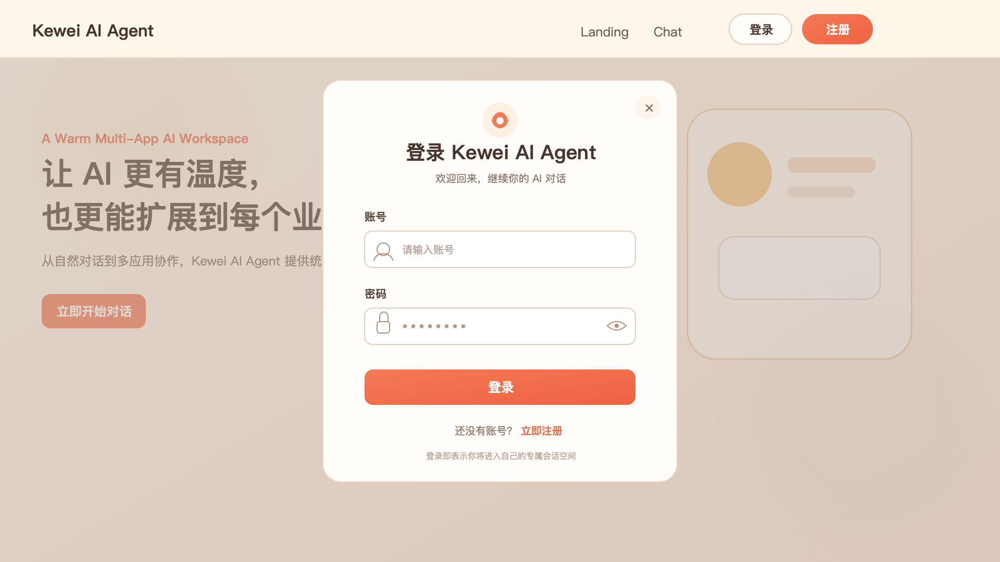
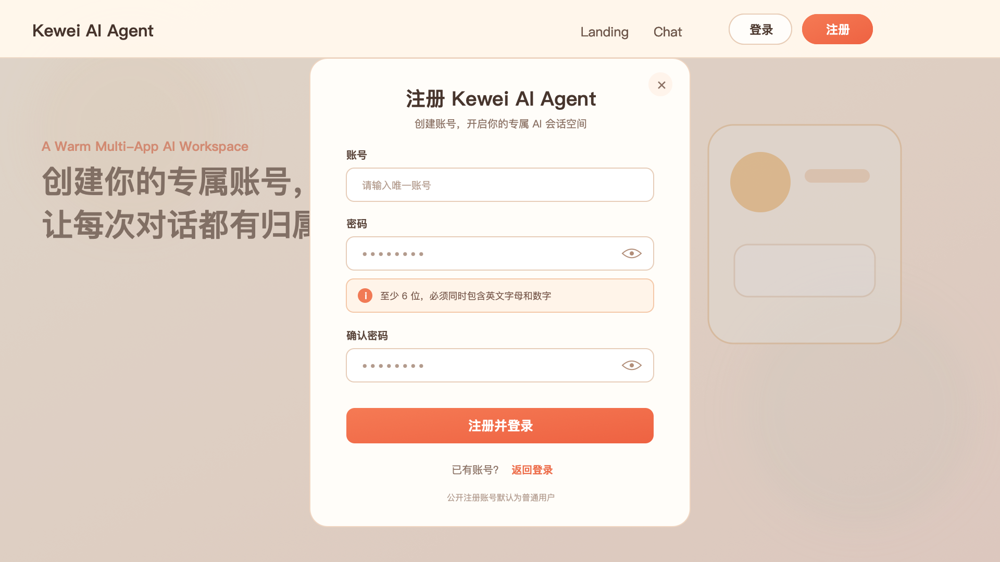

# 01 登录与注册

| 项目 | 内容 |
| --- | --- |
| 需求状态 | 已确认（正式需求基线） |
| 版本 | V1.2 |
| 更新日期 | 2026-08-05 |
| 适用页面 | Landing、Chat 访问入口、全局页头 |

## 一、需求背景

当前平台没有账号身份，任何访问者都可以直接进入 Chat 和 Console，也无法区分不同用户的使用记录。为了支持后续页面权限、个人聊天记录和管理员能力，需要先建立统一的登录与注册入口。

本需求聚焦账号身份的建立与切换，不扩展找回密码、第三方登录等其他账号能力。

## 二、需求目标

1. 在页面右上角提供清晰的“登录”和“注册”入口。
2. 让新用户能够使用账号和密码完成注册，并在成功后直接进入登录状态。
3. 让已有用户能够完成登录，并继续访问登录前想进入的页面。
4. 在登录后明确展示当前账号，并提供退出入口。
5. 确保账号唯一，密码满足基础安全规则且不会以明文形式保存或展示。

## 三、用户角色

- 访客：尚未登录，可查看 Landing，并可发起登录或注册。
- 普通用户：通过公开注册获得的账号，可进入 Chat。
- admin：具备管理权限的账号，登录方式与普通用户一致，额外权限见《02 访问权限与账号管理》。

## 四、全局页头

### 4.1 未登录状态

- 页头右侧依次展示“登录”和“注册”按钮。
- “登录”使用次要按钮样式，“注册”使用橙色主按钮样式。
- 未登录状态不展示账号信息、退出入口和 Console 入口。
- Landing 与 Chat 导航仍可见；点击 Chat 时先进入登录流程。

### 4.2 已登录状态

- 隐藏“登录”和“注册”按钮。
- 页头右侧展示当前账号名称和“退出登录”入口。
- 普通用户不展示 Console；admin 展示 Console。
- 账号名称过长时允许省略显示，但不得影响退出操作。

## 五、登录流程

### 5.1 触发方式

- 点击页头“登录”按钮。
- 访客点击 Chat 导航。
- 访客点击 Landing 中任何进入 Chat 的按钮。
- 访客直接访问 Chat 地址。

### 5.2 登录弹窗

登录采用居中弹窗，当前页面作为背景保留。弹窗包含：

- 标题：登录 Kewei AI Agent。
- 账号输入框。
- 密码输入框。
- 主按钮：登录。
- 辅助入口：没有账号？立即注册。
- 关闭按钮。

不提供“记住我”“忘记密码”和第三方登录入口。

账号输入按以下规则处理：

- 提交登录前去除账号首尾空格。
- 英文字母不区分大小写，例如 `User01` 与 `user01` 视为同一账号。
- 登录成功后，页面展示注册时保留的账号大小写形式，不使用登录时输入的大小写覆盖账号展示值。

### 5.3 登录成功

- 从页头主动打开登录弹窗时，成功后关闭弹窗并停留在当前页面。
- 因访问 Chat 触发登录时，成功后继续进入原本想访问的 Chat 页面。
- 登录成功后，页头立即切换为已登录状态。

### 5.4 登录失败

- 账号或密码不正确时，统一提示“账号或密码错误”，不单独说明账号是否存在。
- 已停用账号登录时，提示“账号已停用，请联系管理员”。
- 登录失败后保留账号输入，清空密码输入，用户可重新填写。

## 六、注册流程

### 6.1 注册弹窗

注册采用与登录一致的居中弹窗，可从页头“注册”按钮或登录弹窗切换进入。弹窗包含：

- 标题：注册 Kewei AI Agent。
- 账号输入框。
- 密码输入框。
- 确认密码输入框。
- 密码规则提示。
- 主按钮：注册并登录。
- 辅助入口：已有账号？返回登录。
- 关闭按钮。

### 6.2 注册规则

| 项目 | 规则 |
| --- | --- |
| 账号 | 必填，去除首尾空格后长度为 3～32 个字符；允许中文、英文字母、数字、下划线（`_`）、短横线（`-`）和英文句点（`.`）；首尾字符必须为中文、英文字母或数字；不允许空格及其他特殊字符 |
| 密码 | 必填，至少 6 位，必须同时包含英文字母和数字 |
| 确认密码 | 必填，必须与密码完全一致 |
| 初始角色 | 公开注册账号统一为普通用户，注册时不能选择 admin |

- 账号唯一性校验不区分英文字母大小写，`User01` 与 `user01` 不能分别注册。
- 账号入库前去除首尾空格，并保留去除空格后的原始大小写形式用于页面展示。

### 6.3 注册校验

- 账号为空时，提示“请输入账号”。
- 账号长度或字符不符合规则时，提示“账号需为 3～32 个字符，仅支持中文、英文字母、数字、下划线、短横线和英文句点，且首尾不能为符号”。
- 账号已存在时，提示“该账号已存在，请更换账号”。
- 密码为空时，提示“请输入密码”。
- 密码不符合规则时，提示“密码至少 6 位，且必须同时包含英文字母和数字”。
- 确认密码为空时，提示“请再次输入密码”。
- 两次密码不一致时，提示“两次输入的密码不一致”。
- 校验提示显示在对应输入框附近，用户修改后可再次提交。

### 6.4 注册成功

- 提示“注册成功”。
- 自动进入新账号的登录状态，无需再次输入账号和密码。
- 从受限页面触发注册时，继续进入原本想访问的页面。
- 从 Landing 主动注册时，关闭弹窗并停留在 Landing。
- 页头立即显示新注册的账号名称和退出入口。

## 七、登录与注册切换

- 登录弹窗点击“立即注册”后，在同一弹窗位置切换到注册内容。
- 注册弹窗点击“返回登录”后，切换到登录内容。
- 切换时保留已填写的账号，密码与确认密码不保留。
- 关闭弹窗后，如用户未完成登录，仍保持访客状态。
- 因访问 Chat 触发弹窗时，关闭弹窗后停留或返回 Landing，不进入 Chat。

## 八、退出登录

- 已登录用户可通过页头“退出登录”退出当前账号。
- 退出登录只注销当前设备的认证会话，不影响同一账号在其他设备上的登录状态。
- 在 Landing 退出后仍停留在 Landing。
- 在 Chat 或 Console 退出后返回 Landing。
- 退出后页头恢复“登录”“注册”按钮，受限页面不能继续使用。
- 再次登录其他账号时，只展示新账号对应的页面状态和聊天记录。

## 九、登录会话规则

- 登录状态由服务端认证会话和安全 Cookie 维护，不在浏览器 `localStorage` 中保存认证令牌。
- Cookie 必须设置 `HttpOnly`；生产环境设置 `Secure`；`SameSite` 按实际前后端部署方式配置，在满足登录请求携带要求的前提下限制跨站发送。
- 登录、注册、退出以及其他修改类请求必须携带服务端签发的 CSRF Token；Token 只保存在前端内存中，不写入 URL、Cookie 可读字段或浏览器持久化存储。
- 登录或注册成功时服务端轮换 Session ID，登录前取得的 CSRF Token 随即失效；前端必须先重新请求 `/auth/csrf`，成功取得新 Token 后才能发起退出或其他修改类请求。
- 修改请求收到 CSRF `403` 时，前端先重新获取 CSRF Token 并查询 `/auth/me`；不得直接反复重试原请求，也不得继续沿用旧 Token。
- 关闭浏览器后继续保持登录状态。
- 认证会话连续 24 小时没有有效访问后失效；每次有效访问刷新最后活跃时间。
- 单次认证会话无论是否持续活跃，最长保留 7 天，达到绝对有效期后必须重新登录。
- 同一账号允许在多个设备或浏览器中同时登录，各设备使用相互独立的认证会话。
- 账号角色发生变化后，已有认证会话的后续请求立即按最新角色鉴权。
- 账号被停用后，不强制注销该账号已有认证会话；已有会话可继续使用，退出或会话失效后不能重新登录。
- SSE 或 Manus 请求执行期间认证会话到期时，不强制中断当前已建立的流式请求；该请求结束后的下一次请求必须重新完成登录校验。

## 十、密码安全要求

- 用户密码必须以安全加密后的形式保存，禁止明文留存。
- 登录、注册和账号管理页面均不得展示用户的原始密码。
- 管理员不能查看、复制或导出任何用户的原始密码。
- 登录失败提示不得泄露某个账号是否真实存在。

## 十一、原型图

### 11.1 登录弹窗

### 11.2 注册弹窗

## 十二、验收标准

1. 访客打开 Landing 时，可以在页头右侧看到“登录”和“注册”按钮。
2. 登录和注册均在当前页面的居中弹窗内完成，并可互相切换。
3. 使用已存在账号注册时，系统阻止提交并显示明确提示。
4. 少于 6 位、仅有字母或仅有数字的密码均不能注册。
5. 同时包含英文字母和数字且不少于 6 位的密码可以通过规则校验。
6. 两次密码不一致时不能注册。
7. 注册成功后自动登录，并回到用户原本想访问的页面。
8. 账号或密码错误时只提示“账号或密码错误”。
9. 已停用账号再次登录时被阻止，并显示停用提示。
10. 登录后页头展示当前账号和退出入口，登录与注册按钮消失。
11. 退出后恢复访客状态，不能继续使用 Chat 或 Console。
12. 任何页面和账号管理区域都不能查看用户原始密码。
13. 账号首尾空格被去除，英文字母大小写不同但其他内容相同的账号不能重复注册，并可以使用任意英文字母大小写形式登录。
14. 长度不足 3 个字符、超过 32 个字符、包含不允许字符或首尾为符号的账号不能注册。
15. 关闭浏览器后重新打开，在会话未超过 24 小时不活跃期限且未达到 7 天绝对期限时仍保持登录。
16. 同一账号可在多个设备同时登录，任一设备退出只影响该设备。
17. 角色调整后已有会话的下一次请求立即按新角色鉴权；账号停用后已有会话不被强制注销，但退出或失效后不能重新登录。
18. 认证信息不写入 `localStorage`，认证 Cookie 符合 `HttpOnly`、生产环境 `Secure` 和既定 `SameSite` 安全要求。

## 十三、不在本期范围

- 手机号、邮箱、验证码注册。
- 忘记密码、自助找回密码和修改密码。
- 第三方账号登录。
- 记住登录状态的独立开关。
- 用户资料、头像和昵称维护。
