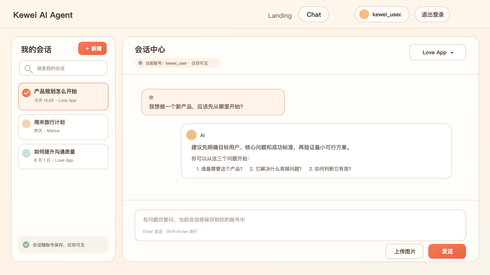
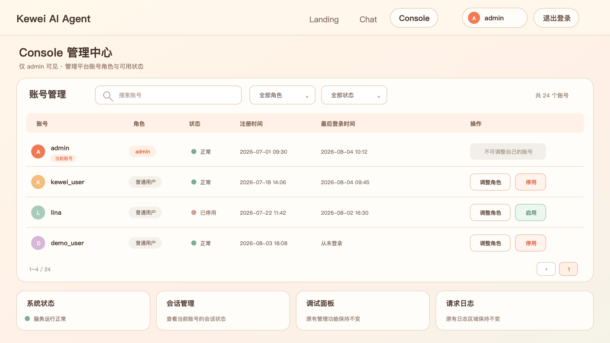

# 02 访问权限与账号管理

| 项目 | 内容 |
| --- | --- |
| 需求状态 | 待评审 |
| 版本 | V1.0 |
| 更新日期 | 2026-08-04 |
| 适用页面 | Landing、Chat、Console、全局页头 |

## 一、需求背景

账号体系建立后，需要进一步明确不同身份能够看到和使用的页面，并确保每个账号的聊天记录互不混淆。同时，Console 需要提供基础账号管理能力，供 admin 管理账号角色和可用状态。

本需求只定义页面权限、聊天记录归属和账号管理规则，不改变 Landing、Chat 与 Console 原有业务功能。

## 二、需求目标

1. Landing 对所有访问者开放，无需登录。
2. Chat 仅允许已登录账号使用。
3. 不同账号只能查看和继续自己的聊天记录。
4. 同一账号重新登录或更换设备后，仍可查看自己的历史记录。
5. Console 仅 admin 可见和使用。
6. admin 可在 Console 中查询账号、调整角色以及启用或停用账号。

## 三、角色定义

| 角色 | 定义 |
| --- | --- |
| 访客 | 尚未登录的访问者 |
| 普通用户 | 通过公开注册获得的账号，可使用 Chat |
| admin | 具备 Console 访问与账号管理权限的账号 |

- 公开注册只能获得普通用户角色。
- 系统正式开放前至少应存在一个可用的 admin。
- admin 的聊天记录仍属于其个人账号，不因管理身份获得其他用户聊天内容的查看权限。

## 四、页面权限矩阵

| 身份 | Landing | Chat | Console |
| --- | --- | --- | --- |
| 访客 | 可直接查看 | 访问时要求登录 | 不显示入口；直接访问时返回 Landing 并提示先登录 |
| 普通用户 | 可查看 | 可使用，仅查看本人记录 | 不显示入口；直接访问时返回 Landing 并提示无权限 |
| admin | 可查看 | 可使用，仅查看本人记录 | 可查看和使用 |

## 五、页面入口与访问行为

### 5.1 Landing

- 访客、普通用户和 admin 均可直接查看。
- 访客进入 Landing 时，页头显示登录和注册入口。
- 已登录用户进入 Landing 时，页头显示当前账号和退出入口。
- 普通用户不显示 Console 导航及相关按钮。
- admin 显示 Console 导航及相关按钮。

### 5.2 Chat

- 访客点击 Chat 导航或 Landing 中的 Chat 按钮时，打开登录弹窗。
- 访客关闭登录弹窗后不进入 Chat，仍停留或返回 Landing。
- 登录或注册成功后，继续进入原本想访问的 Chat 页面。
- 普通用户和 admin 均可使用 Chat，但只能看到当前账号的聊天记录。
- 用户退出登录后，立即离开 Chat 并返回 Landing。

### 5.3 Console

- 只有 admin 的页头显示 Console 入口。
- 访客直接访问 Console 时返回 Landing，并提示“请先登录后访问”。
- 普通用户直接访问 Console 时返回 Landing，并提示“当前账号无 Console 访问权限”。
- admin 角色被调整为普通用户后，Console 权限立即失效；再次进入或继续操作时返回 Landing，并显示无权限提示。
- admin 退出登录后立即离开 Console 并返回 Landing。

## 六、聊天记录按账号隔离

### 6.1 记录归属

- 每次新建会话时，该会话归属于当前登录账号。
- 会话列表、会话内容以及会话中上传的图片均跟随所属账号。
- 当前账号只能查看、选择和继续自己的会话。
- 账号管理页面不提供查看聊天记录的入口。

### 6.2 账号切换

- 用户退出账号 A 后，Chat 页面不得继续展示账号 A 的会话内容。
- 登录账号 B 后，只加载账号 B 的会话列表和内容。
- 再次登录账号 A 时，可继续查看账号 A 之前的聊天记录。
- 账号切换过程中不得短暂展示上一账号的会话列表或消息内容。

### 6.3 长期留存与跨设备

- 同一账号重新登录后，历史聊天记录仍然存在。
- 同一账号在其他设备登录后，可以查看相同的会话列表和会话内容。
- 新设备上产生的会话，后续在同一账号的其他设备中也应可见。
- 不同账号即使在同一设备登录，也不能看到彼此的聊天记录。

### 6.4 admin 的记录范围

- admin 在 Chat 中只能查看自己账号的聊天记录。
- admin 不能通过 Console 的账号管理查看、搜索或导出其他账号的聊天内容。
- 角色从普通用户调整为 admin，或从 admin 调整为普通用户时，账号已有聊天记录的归属不变。

## 七、Console 账号管理

### 7.1 页面位置

- 在 Console 首屏增加“账号管理”区域。
- 账号管理区域优先展示在原有 Console 功能之前。
- 保留 Console 原有功能和页面风格。

### 7.2 账号列表

账号列表展示以下信息：

| 字段 | 说明 |
| --- | --- |
| 账号 | 用户注册时使用的账号 |
| 角色 | 普通用户或 admin |
| 状态 | 正常或已停用 |
| 注册时间 | 账号完成注册的时间 |
| 最后登录时间 | 账号最近一次成功登录的时间；从未登录时显示“从未登录” |
| 操作 | 调整角色、启用或停用 |

- 列表不得展示密码或任何可推断原始密码的信息。
- 账号较多时支持分页查看。
- 当前登录的 admin 行需要显示“当前账号”标识。

### 7.3 查询与筛选

- 支持按账号关键词搜索。
- 支持按角色筛选：全部、普通用户、admin。
- 支持按状态筛选：全部、正常、已停用。
- 搜索和筛选可以组合使用。
- 没有匹配账号时，展示“暂无符合条件的账号”。

### 7.4 角色调整

- admin 可以将其他普通用户调整为 admin。
- admin 可以将其他 admin 调整为普通用户。
- 角色调整前需要二次确认，并明确展示目标账号和调整后的角色。
- 调整成功后，列表立即显示新角色，目标账号的页面权限立即按新角色生效。
- 当前登录的 admin 不能调整自己的角色。
- 系统必须始终保留至少一个正常状态的 admin。

### 7.5 启用与停用

- admin 可以停用其他正常账号。
- admin 可以重新启用已停用账号。
- 停用前需要二次确认，并提示“该账号退出后将无法再次登录”。
- 按已确认规则，停用不强制中断目标账号当前的登录；目标账号退出后，下一次登录将被阻止。
- 已停用账号登录时提示“账号已停用，请联系管理员”。
- 重新启用后，账号可正常登录，原有聊天记录保持不变。
- 当前登录的 admin 不能停用自己的账号。
- 系统必须始终保留至少一个正常状态的 admin。

### 7.6 不提供的管理动作

- 不提供管理员新建账号。
- 不提供账号删除。
- 不提供查看或导出用户密码。
- 不提供查看、搜索或导出其他账号的聊天内容。

## 八、页面状态与提示

| 场景 | 页面行为 | 提示文案 |
| --- | --- | --- |
| 访客访问 Chat | 打开登录弹窗 | 登录后即可使用 Chat |
| 访客直接访问 Console | 返回 Landing | 请先登录后访问 |
| 普通用户直接访问 Console | 返回 Landing | 当前账号无 Console 访问权限 |
| admin 被降级后继续使用 Console | 返回 Landing | 当前账号无 Console 访问权限 |
| 已停用账号再次登录 | 停留在登录弹窗 | 账号已停用，请联系管理员 |
| 账号搜索无结果 | 保留账号管理页面 | 暂无符合条件的账号 |
| 角色调整成功 | 刷新目标账号角色 | 角色调整成功 |
| 账号停用成功 | 刷新目标账号状态 | 账号已停用，将在下次登录时生效 |
| 账号启用成功 | 刷新目标账号状态 | 账号已启用 |

## 九、原型图

### 9.1 普通用户 Chat

### 9.2 admin Console 账号管理

## 十、验收标准

### 10.1 页面权限

1. 访客可以直接查看 Landing。
2. 访客不能直接使用 Chat，完成登录或注册后才能进入。
3. 访客和普通用户的页头均不显示 Console。
4. 普通用户直接访问 Console 时返回 Landing，并收到无权限提示。
5. admin 可以看到并进入 Console。
6. admin 被调整为普通用户后，Console 权限立即失效。

### 10.2 聊天记录隔离

1. 分别使用普通账号 A 和账号 B 创建会话，两个账号只能看到各自的会话列表和内容。
2. 账号 A 退出后，页面不再展示账号 A 的聊天内容。
3. 账号 A 重新登录后，原有会话仍可查看和继续。
4. 账号 A 在其他设备登录后，可查看相同的历史记录。
5. admin 进入 Chat 时也只能看到 admin 自己的聊天记录。
6. Console 账号管理中不存在查看其他账号聊天内容的入口。

### 10.3 账号管理

1. admin 可以按账号搜索，并按角色和状态组合筛选。
2. admin 可以将其他普通用户调整为 admin，也可以将其他 admin 调整为普通用户。
3. admin 可以停用和重新启用其他账号。
4. 停用账号的当前登录可继续使用，退出后不能再次登录。
5. 重新启用账号后可以登录，原有聊天记录不丢失。
6. admin 不能调整自己的角色或停用自己的账号。
7. 任何操作都不能导致系统不存在正常状态的 admin。
8. 账号管理不提供新建、删除、查看密码或查看聊天内容功能。

## 十一、不在本期范围

- 账号删除和数据注销。
- 管理员代替用户新建账号。
- 聊天记录共享、转移或公开。
- 管理员查看用户聊天内容。
- 更细粒度的角色和权限配置。

