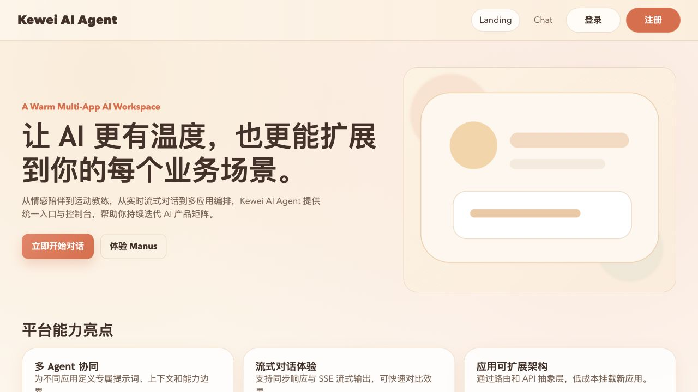
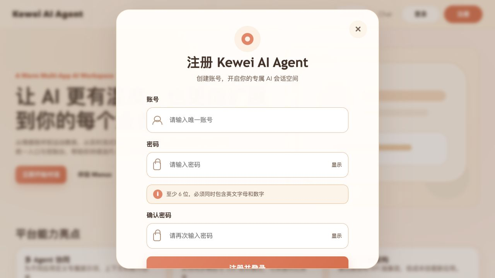
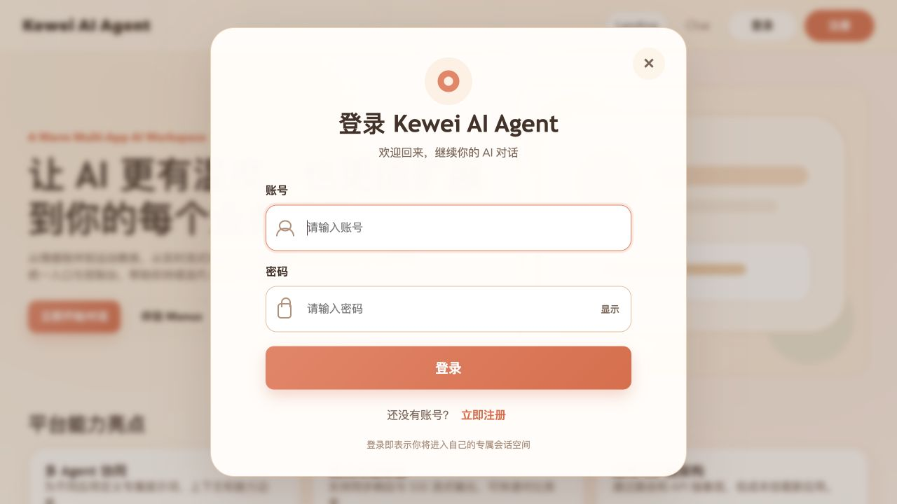
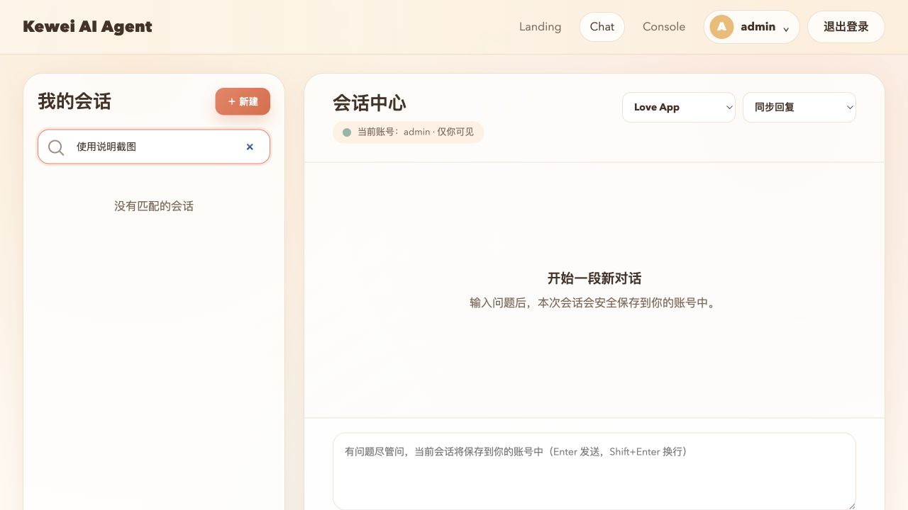
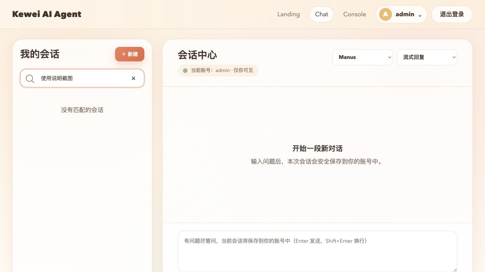
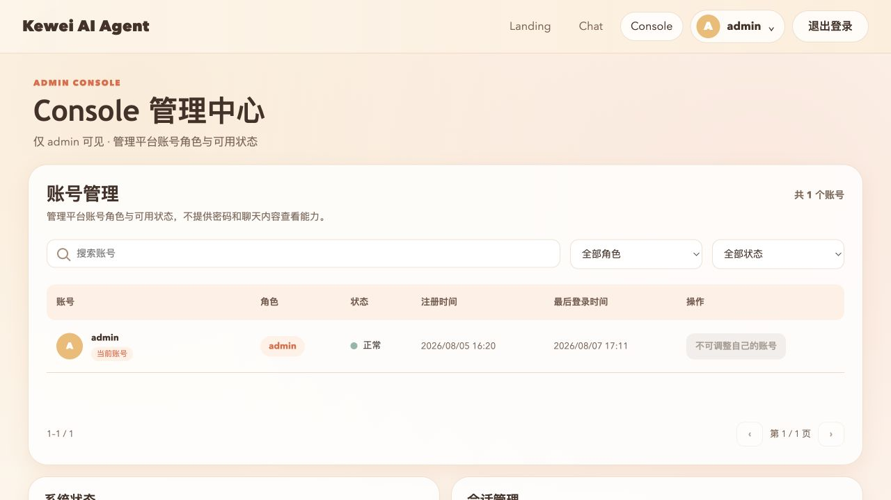
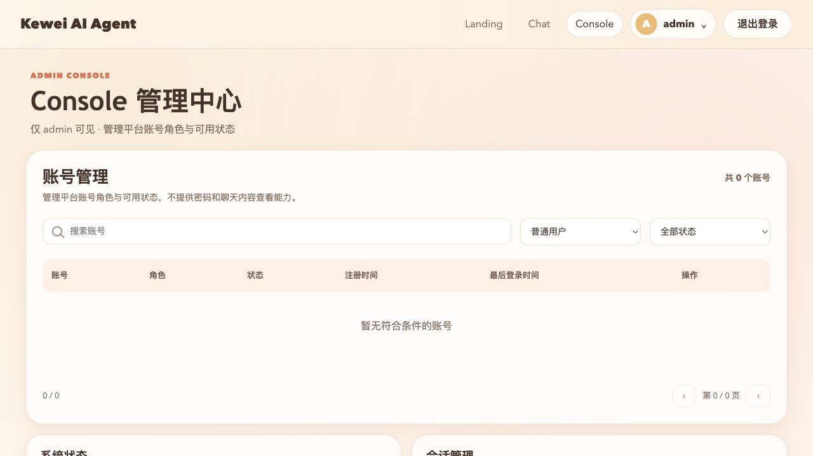

# 账号体系与权限管理功能使用说明

## 一、文档信息

| 项目 | 内容 |
| --- | --- |
| 项目名称 | Kewei AI Agent |
| 适用分支 | `dev_zzx` |
| 适用环境 | 本地测试环境 |
| 前端地址 | `http://localhost:5173` |
| 后端地址 | `http://localhost:8123/api` |
| 文档日期 | 2026-08-08 |
| 覆盖范围 | 第一批至第四批账号体系、会话隔离、登录注册前端与 Console 账号管理功能 |

本文档面向测试人员和功能验收人员，说明四批代码开发完成了哪些功能，以及如何在测试环境中逐步使用这些功能。

> 安全说明：本文档不记录任何密码、Cookie、Session ID、CSRF Token 或密码摘要。测试管理员账号为 `admin`，密码应由环境管理员通过安全渠道提供。

## 二、四批开发完成的功能

### 2.1 第一批：账号与认证基础

- 建立账号数据模型和 MySQL 账号表。
- 提供注册、登录、退出和当前账号查询接口。
- 密码使用 BCrypt 强度 12 保存摘要，不保存或返回明文密码。
- 使用 Redis HttpSession 保存登录状态，支持多设备独立登录。
- 登录和注册成功后轮换 Session ID，避免会话固定攻击。
- 使用 Spring Security 统一处理未登录、无权限和角色校验。
- 修改类请求使用 CSRF Token，Token 只保存在前端内存中。
- 初始 admin 仅允许通过环境变量幂等创建，不自动覆盖已有账号密码或角色。

### 2.2 第二批：聊天会话隔离与持久化

- 聊天会话由服务端生成会话 ID，并固定归属于当前登录账号。
- 不同账号只能查看自己的会话、消息、附件和 Manus 执行记录。
- 支持会话标题搜索和每批 20 条的稳定游标分页。
- Love App 同步回复、流式回复和事件流回复均可保存为历史消息。
- Manus 的任务、Todo、补充问题、补充回答和执行状态均可持久化。
- 服务重启后，未完成的 Manus 执行标记为已中断，不自动重复执行。
- 支持 JPEG、PNG、WebP 图片附件，单张最大 10 MB。
- 附件只能由所属账号通过受控接口读取，不暴露服务器文件路径。

### 2.3 第三批：登录注册与账号会话前端

- 完成登录、注册居中弹窗及密码显示切换。
- 完成账号、密码和确认密码的实时校验与错误提示。
- 访客访问 Chat 或 Console 时自动进入权限判断流程。
- 全局页头根据访客、普通用户和 admin 展示不同入口。
- Chat 左侧展示当前账号的会话列表、标题搜索和“加载更多”。
- 点击“新建”只产生空白草稿，首次发送有效消息时才创建正式会话。
- 切换会话或刷新页面后可以恢复服务端历史消息。
- 退出、账号切换或认证失效时清理上一账号的页面状态。

### 2.4 第四批：Console 账号管理

- 在 Console 首屏最前方增加账号管理区域，保留原有 Console 功能。
- 支持账号关键词、角色和状态组合筛选。
- 账号列表默认每页 20 条，显示总记录数和总页数。
- admin 可以调整其他账号的角色。
- admin 可以启用或停用其他账号。
- 角色和状态操作均有二次确认。
- 当前 admin 不能调整自己的角色或停用自己的账号。
- 系统始终保留至少一个正常状态的 admin。
- 角色和状态修改使用账号版本检测冲突，旧页面不能覆盖新操作。
- 角色调整后，目标账号的 Console 权限立即生效或失效。

## 三、页面权限说明

| 身份 | Landing | Chat | Console |
| --- | --- | --- | --- |
| 访客 | 可以访问 | 访问时要求登录或注册 | 不显示入口；直接访问会返回 Landing |
| 普通用户 | 可以访问 | 可以使用，只能查看自己的会话 | 不显示入口；直接访问会提示无权限 |
| admin | 可以访问 | 可以使用，只能查看自己的会话 | 可以访问并管理账号 |

admin 只具备账号管理权限，不能通过 Console 查看其他账号的聊天内容、密码或附件。

## 四、进入测试环境

### 4.1 打开页面

1. 确认前端、后端、MySQL、PostgreSQL 和 Redis 已启动。
2. 在浏览器打开 `http://localhost:5173`。
3. 页面默认进入 Landing。
4. 访客页头显示 Landing、Chat、登录和注册，不显示 Console。

### 4.2 受限页面行为

- 访客点击 Chat，会返回 Landing 并打开登录弹窗。
- 访客直接输入 `/console`，会返回 Landing 并提示“请先登录后访问”。
- 普通用户直接输入 `/console`，会返回 Landing 并提示“当前账号无 Console 访问权限”。

## 五、注册普通用户

### 5.1 注册步骤

1. 在 Landing 页头点击“注册”，或在登录弹窗点击“立即注册”。
2. 输入唯一账号。
3. 输入密码。
4. 再次输入相同密码。
5. 点击“注册并登录”。
6. 注册成功后自动进入登录状态，无需再次输入账号和密码。

### 5.2 输入规则

- 账号长度为 3～32 个字符。
- 账号支持中文、英文字母、数字、下划线、短横线和英文句点。
- 账号首尾不能是符号。
- 账号英文字母大小写不敏感，不能使用仅大小写不同的重复账号。
- 密码至少 6 位，并且必须同时包含英文字母和数字。
- 两次输入的密码必须完全一致。
- 公开注册获得的角色固定为普通用户，不能自行注册为 admin。

### 5.3 常见注册提示

| 场景 | 页面提示 |
| --- | --- |
| 账号为空 | 请输入账号 |
| 密码为空 | 请输入密码 |
| 密码规则不满足 | 密码至少 6 位，且必须同时包含英文字母和数字 |
| 确认密码为空 | 请再次输入密码 |
| 两次密码不一致 | 两次输入的密码不一致 |
| 账号已存在 | 该账号已存在，请更换账号 |

## 六、登录与退出

### 6.1 登录步骤

1. 在 Landing 页头点击“登录”。
2. 输入账号。
3. 输入密码。
4. 如需核对输入内容，可点击密码框右侧“显示”。
5. 点击“登录”。
6. 登录成功后，页头显示当前账号和“退出登录”。
7. admin 登录后，页头额外显示 Console 入口。

测试管理员账号为 `admin`，密码由环境管理员提供，不应写入代码、文档或聊天记录。

### 6.2 登录失败与账号停用

- 账号或密码错误时统一提示“账号或密码错误”，不会暴露账号是否存在。
- 已停用账号退出后不能重新登录，页面提示“账号已停用，请联系管理员”。
- 登录状态连续 24 小时没有有效访问后失效。
- 单次登录会话最长保留 7 天，到期后需要重新登录。

### 6.3 退出步骤

1. 点击页头“退出登录”。
2. 当前设备的登录会话立即失效。
3. Chat 或 Console 页面会返回 Landing。
4. 页头恢复登录和注册入口。
5. 同一账号在其他设备上的登录状态不受影响。

## 七、使用 Chat 会话中心

### 7.1 进入 Chat

1. 完成登录。
2. 点击页头 Chat。
3. 左侧显示“我的会话”，右侧显示“会话中心”。
4. 页面只加载当前账号所属的会话。

下图使用空白草稿并过滤了既有会话标题，未展示测试账号的真实聊天正文。

### 7.2 新建会话

1. 点击左侧“新建”。
2. 右侧出现空白草稿。
3. 此时服务端不会立即写入空会话。
4. 选择应用和回复模式。
5. 输入第一条有效消息并发送。
6. 服务端在首次发送时创建正式会话并生成会话 ID。
7. 第一条文本消息会生成最长 30 个字符的默认标题。
8. 如果第一条消息只有图片，默认标题为“图片会话”。

### 7.3 选择应用和回复模式

| 应用 | 可用模式 | 使用建议 |
| --- | --- | --- |
| Love App | 同步回复 | 等待完整回复后一次显示，适合短问题 |
| Love App | 流式回复 | 回复内容逐步出现，适合较长回答 |
| Love App | 事件流回复 | 使用 SSE 事件流展示回复 |
| Manus | 流式回复 | 用于多步骤任务、Todo 和补充问题 |

选择 Manus 后，回复模式固定为流式回复。

### 7.4 发送文本消息

1. 在输入框输入内容。
2. 按 Enter 或点击“发送”。
3. 使用 Shift+Enter 换行。
4. 回复完成后，用户消息和 AI 消息保存到当前账号会话。
5. 刷新页面或重新登录后，可以继续查看和使用该会话。

### 7.5 上传图片

1. 在空白草稿或已有会话中点击“上传图片”。
2. 选择 JPEG、PNG 或 WebP 图片。
3. 单张图片不能超过 10 MB。
4. 输入可选文本后点击“发送”。
5. 图片由服务端受控保存并关联当前账号和会话。

1～10 MB 的合法图片同样支持上传。超过 10 MB 时，页面会阻止发送；直接调用接口时，服务端返回 HTTP 413 和“单张图片不能超过 10 MB”的明确提示。GIF、SVG、伪造扩展名、MIME 类型不一致或真实内容不合法的图片会被拒绝。

### 7.6 使用 Manus

1. 点击“新建”进入空白草稿。
2. 将“会话应用”切换为 Manus。
3. 输入需要分步骤完成的任务。
4. 点击“发送”。
5. 页面通过流式事件展示执行过程。
6. 如果 Manus 生成 Todo，页面会持续展示任务进度。
7. 如果 Manus 需要补充信息，按页面问题输入答案后继续。
8. 执行完成、失败或中断后，状态和过程消息会保存到历史会话。

服务重启前仍处于执行中或等待补充信息的任务，会显示为已中断，不会自动重复执行。

### 7.7 搜索和加载历史会话

1. 在左侧“搜索我的会话”输入标题关键词。
2. 搜索只匹配当前账号的会话标题，不搜索消息正文。
3. 关键词会去除首尾空格，英文字母不区分大小写。
4. 每次最多加载 20 条会话。
5. 会话超过 20 条时，点击“加载更多”读取下一批。
6. 点击会话标题可以恢复结构化历史消息。
7. 刷新当前会话时，URL 中的会话 ID 用于恢复同一会话。

### 7.8 会话隔离规则

- 账号 A 不能查看账号 B 的会话、消息或附件。
- admin 在 Chat 中也只能查看自己的聊天记录。
- 退出账号 A 后，页面会清空账号 A 的会话状态。
- 登录账号 B 后，只加载账号 B 的数据。
- 再次登录账号 A 后，可以继续查看账号 A 的历史会话。
- 角色调整、账号停用和退出登录不会删除已保存的会话或附件。

## 八、使用 Console 账号管理

### 8.1 进入 Console

1. 使用 admin 账号登录。
2. 点击页头 Console。
3. 页面进入“Console 管理中心”。
4. 账号管理区域展示在原有系统状态、会话管理和 API 调试面板之前。

当前测试截图中只有一个正式 admin，因此当前账号行显示“不可调整自己的账号”。当测试库存在其他账号时，其他账号行会出现“调整角色”和“停用”或“启用”按钮。

### 8.2 查看账号列表

账号列表展示：

- 账号名称。
- 角色：普通用户或 admin。
- 状态：正常或已停用。
- 注册时间。
- 最后登录时间；从未登录时显示“从未登录”。
- 可用管理操作。
- 当前登录 admin 的“当前账号”标识。

列表不会展示密码、密码摘要、Cookie、Session、聊天消息或附件内容。

### 8.3 搜索、筛选和分页

1. 在“搜索账号”输入账号关键词。
2. 在角色下拉框选择全部角色、普通用户或 admin。
3. 在状态下拉框选择全部状态、正常或已停用。
4. 三个条件可以组合使用。
5. 条件变化后自动回到第 1 页。
6. 没有匹配结果时显示“暂无符合条件的账号”。
7. 默认每页展示 20 条。
8. 使用列表右下角上一页、下一页按钮翻页。

### 8.4 调整账号角色

1. 找到目标账号。
2. 点击“调整角色”。
3. 在二次确认弹窗核对目标账号和新角色。
4. 点击“确认修改”。
5. 列表刷新并显示目标账号的新角色。
6. 普通用户提升为 admin 后，已有登录会话立即获得 Console 权限。
7. admin 降级为普通用户后，已有登录会话的下一次 Console 请求立即失去权限。

限制：

- 当前 admin 不能调整自己的角色。
- 不能将最后一个正常状态的 admin 降级为普通用户。
- 如果其他管理员已经修改过同一账号，旧页面会提示刷新后重试，不会覆盖新结果。

### 8.5 停用账号

1. 找到状态为“正常”的目标账号。
2. 点击“停用”。
3. 在二次确认弹窗核对目标账号和停用提示。
4. 点击“确认修改”。
5. 列表刷新并显示“已停用”。

停用后：

- 目标账号已建立的登录会话不会被主动中断。
- 目标账号退出或会话失效后不能再次登录。
- 账号原有聊天记录和附件仍然保留。
- 当前 admin 不能停用自己的账号。
- 不能停用最后一个正常状态的 admin。

### 8.6 重新启用账号

1. 将状态筛选切换为“已停用”。
2. 找到目标账号。
3. 点击“启用”。
4. 在二次确认弹窗点击“确认修改”。
5. 目标账号状态恢复为“正常”。
6. 目标账号可以重新登录，原有聊天记录保持不变。

### 8.7 Console 原有功能

账号管理下方仍保留：

- 系统状态：点击“立即检查”查询后端健康状态。
- 会话管理：查看当前 admin 自己的会话标识，不能查看其他账号会话。
- API 调试面板：选择 Love App 或 Manus 接口进行调试。
- 请求日志：显示当前页面发起的调试请求结果和耗时。

## 九、建议的测试环境操作顺序

### 9.1 普通用户流程

1. 打开 Landing。
2. 点击注册并创建普通账号。
3. 确认页头不显示 Console。
4. 进入 Chat。
5. 点击“新建”，确认没有立即生成服务端会话。
6. 使用 Love App 同步模式发送一条文本消息。
7. 刷新页面，确认历史消息恢复。
8. 切换到流式回复并发送第二条消息。
9. 上传一张合法图片并发送。
10. 切换到 Manus 发起多步骤任务。
11. 使用标题搜索找到刚创建的会话。
12. 退出登录，再次登录后确认历史会话仍存在。

### 9.2 admin 流程

1. 使用 admin 登录。
2. 确认页头显示 Console。
3. 进入 Console 并点击“立即检查”。
4. 使用关键词、角色和状态组合筛选普通测试账号。
5. 将测试账号从普通用户提升为 admin，观察目标账号权限立即生效。
6. 将测试账号恢复为普通用户，观察 Console 权限立即失效。
7. 停用测试账号，确认已有会话保持、退出后不能登录。
8. 重新启用测试账号，确认可以登录且历史聊天记录未丢失。
9. 确认当前 admin 自身没有角色调整和停用入口。
10. 确认账号管理页面没有密码、聊天内容、账号新建和账号删除入口。

> 测试角色和状态修改时，应使用专门的临时测试账号，禁止对正式业务账号执行演示操作。测试完成后按数据清理流程处理临时账号和会话。

## 十、常见问题处理

| 现象 | 可能原因 | 处理方式 |
| --- | --- | --- |
| 打开 Chat 后返回 Landing | 当前未登录或会话已失效 | 完成登录后重新进入 Chat |
| 页头没有 Console | 当前账号不是 admin | 使用 admin 登录，或由其他 admin 调整角色 |
| 直接访问 Console 提示无权限 | 当前账号为普通用户 | 返回 Chat 使用普通用户功能 |
| 登录提示账号已停用 | 账号状态为已停用 | 联系 admin 在 Console 中重新启用 |
| 账号列表没有结果 | 搜索、角色或状态条件不匹配 | 清空搜索并恢复全部角色、全部状态 |
| 修改账号时提示状态已变化 | 其他 admin 已完成新操作 | 刷新列表后重新核对并操作 |
| 不能调整或停用某个 admin | 目标是当前账号或最后一个正常 admin | 使用其他 admin 操作，并确保至少保留一个正常 admin |
| 会话搜索不到消息内容 | 本期只支持标题搜索 | 使用会话标题关键词搜索 |
| 上传图片提示超过限制 | 图片超过 10 MB | 选择不超过 10 MB 的真实 JPEG、PNG 或 WebP；接口调用方应识别 HTTP 413 和业务码 41301 |
| 10 MB 以内图片仍提示服务异常 | 后端 Multipart 限制未按项目配置生效，或后端未使用最新代码重启 | 确认后端已加载单文件 10 MB、总请求 12 MB 配置并完成重启 |
| 上传图片失败 | 扩展名、MIME 或真实内容不合法 | 使用扩展名、MIME 和真实内容一致的 JPEG、PNG 或 WebP |
| Manus 重启后显示中断 | 服务重启前任务仍在执行或等待补充信息 | 在原会话明确发起一次新的 Manus 任务 |
| 后端健康检查失败 | 后端或依赖容器未启动 | 检查后端、MySQL、PostgreSQL、Redis 和配置中心连接 |

## 十一、安全与数据注意事项

- 不要在截图、文档、日志或聊天内容中记录真实密码。
- 不要复制或共享浏览器 Cookie、Session ID 或 CSRF Token。
- 管理员密码重置后，应使用安全渠道告知使用者，并在演示结束后再次轮换临时密码。
- 不要使用 Console 管理正式业务账号进行演示。
- 停用账号不会立即中断已有登录会话，应在验收时按需求理解这一行为。
- Chat 和 Console 的账号边界由服务端校验，不能通过修改 URL 获得其他账号数据。
- 本期不提供账号删除、会话删除、会话重命名、消息全文搜索或管理员查看用户聊天内容。

## 十二、四批功能提交对应关系

| 批次 | 功能提交 | 主要内容 |
| --- | --- | --- |
| 第一批 | `3b9046a` | 账号、注册登录、Redis Session、Spring Security、CSRF 与初始 admin |
| 第二批 | `ce47405` | 会话归属、历史消息、附件、Manus 持久化与跨账号隔离 |
| 第三批 | `cf519ea` | 登录注册弹窗、页头权限、Chat 会话列表与历史恢复 |
| 第四批 | `b63f843` | Console 账号查询、角色状态管理、并发和最后 admin 保护 |

各批次的详细验收证据位于同级目录“验收报告”中。
