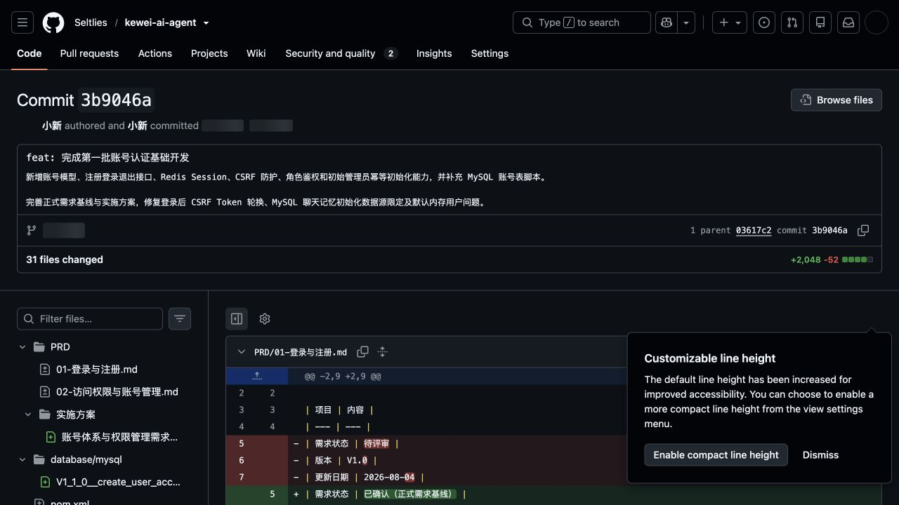

# 第一批账号认证功能验收报告

## 一、验收结论

第一批账号认证基础功能已完成开发、独立代码复审、运行时接口验收和数据库检查，当前结论为：**通过开发自验，申请仓库持有者验收**。

| 项目 | 内容 |
| --- | --- |
| 项目 | Kewei AI Agent |
| 验收批次 | 第一批：账号与认证基础 |
| 验收分支 | `dev_zzx` |
| 远程提交 | `3b9046a8d675b4552da5e779e6385e738919d503` |
| 提交说明 | `feat: 完成第一批账号认证基础开发` |
| 验收日期 | 2026-08-05 |
| 自验结果 | 通过 |

## 二、本批实现范围

- 新增账号数据模型、账号规则、注册、登录、退出和当前账号查询接口。
- 使用 BCrypt 强度 12 保存密码摘要，不保存或返回明文密码。
- 使用 Redis HttpSession 保存认证会话，支持多设备独立登录和当前设备退出。
- 接入 Spring Security，统一处理未登录、无权限、角色校验和受限接口访问。
- 使用基于 HttpSession 的 CSRF Token；登录或注册后轮换 Session ID 并废止登录前 Token。
- 支持初始管理员通过环境变量幂等创建，账号表非空时不重复创建、不提权、不覆盖密码。
- 新增 MySQL 账号表和系统初始化锁表脚本。
- 固定启用 MySQL 聊天记忆初始化，并明确限定 MySQL 数据源。
- 排除 Spring Boot 默认内存用户和随机开发密码。
- 将已确认规则同步到正式 PRD 和实施方案。

## 三、接口验收结果

本轮使用运行中的本地服务重新执行以下检查，未在报告中记录密码、Cookie、Session ID 或 CSRF Token。

| 验收项 | 预期结果 | 实际结果 | 结论 |
| --- | --- | --- | --- |
| 健康检查 | HTTP 200 | HTTP 200 | 通过 |
| 未登录访问当前账号 | HTTP 401 | HTTP 401 | 通过 |
| 缺少 CSRF Token 发起登录 | HTTP 403 | HTTP 403 | 通过 |
| 管理员使用正确凭据登录 | HTTP 200 | HTTP 200 | 通过 |
| 登录后 CSRF Token 轮换 | 新旧 Token 不同 | 新旧 Token 不同 | 通过 |
| 使用登录前 Token 退出 | HTTP 403 | HTTP 403 | 通过 |
| 旧 Token 被拒绝后的登录态 | HTTP 200 | HTTP 200 | 通过 |
| 使用登录后新 Token 退出 | HTTP 200 | HTTP 200 | 通过 |
| 退出后再次访问当前账号 | HTTP 401 | HTTP 401 | 通过 |
| 前端来源 CORS 预检 | HTTP 200 | HTTP 200 | 通过 |

此前完整验收同时覆盖：合法账号注册并自动登录、账号英文字母大小写不敏感去重、错误密码拒绝、多设备会话相互独立，以及退出仅注销当前设备。

## 四、数据库检查结果

| 检查项 | 结果 | 结论 |
| --- | --- | --- |
| `ai_user_account` | 已创建 | 通过 |
| `ai_system_lock` | 已创建 | 通过 |
| `ai_chat_memory_message` | 已创建 | 通过 |
| 有效管理员 | 1 个 | 通过 |
| 聊天记忆数据 | 0 条 | 符合匿名历史数据不迁移要求 |
| 聊天记忆存储引擎 | InnoDB | 通过 |
| 聊天记忆字符集排序规则 | `utf8mb4_unicode_ci` | 通过 |

## 五、代码复审结果

本批代码经过独立只读复审。复审发现并关闭了以下问题：

1. 仅轮换 Session ID 不会自动删除旧 CSRF Token，现已在认证会话建立后显式删除旧 Token。
2. Lombok 生成的构造器未携带 MySQL `JdbcTemplate` 限定信息，现已改为显式限定构造器注入。

修正后再次复审，未发现新的 P1 或 P2 安全、启动问题。

## 六、远程提交截图

截图对应 GitHub 提交：<https://github.com/Seltlies/kewei-ai-agent/commit/3b9046a8d675b4552da5e779e6385e738919d503>

## 七、验收环境说明

- 应用端口：8123，接口上下文路径：`/api`。
- MySQL、PostgreSQL、Redis 使用本地容器环境。
- MySQL 与 Redis 本地凭据通过进程环境变量注入，未写入代码仓库。
- Nacos 当前账号可以读取配置，但没有远程配置发布权限；本地验收使用环境变量覆盖连接配置。该问题不影响本批功能验收，但在集成环境取消环境变量覆盖前需要补齐 Nacos 发布权限并更新连接配置。

## 八、仓库持有者建议验收项

1. 检查 `dev_zzx` 分支提交 `3b9046a` 的代码范围和安全配置。
2. 在验收环境执行 `V1_1_0__create_user_account.sql`。
3. 通过环境变量提供数据库、Redis 和初始管理员配置，确认应用可以正常启动。
4. 按本报告第三部分重新执行认证和 CSRF 链路。
5. 确认第一批通过后，再进入第二批页面权限与聊天数据隔离开发。
