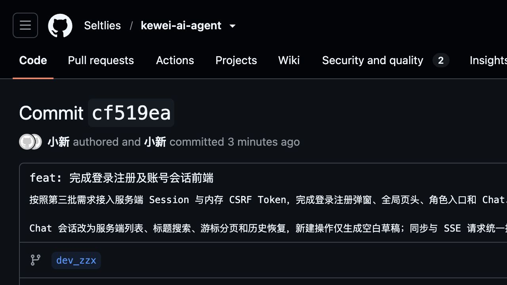

# 第三批登录注册及账号会话前端验收报告

## 一、验收结论

第三批登录注册及账号状态前端已完成开发、生产构建、代码检查、接口数据准备和浏览器端到端验收，当前结论为：**通过开发自验，可进入 Console 账号管理批次**。

| 项目 | 内容 |
| --- | --- |
| 项目 | Kewei AI Agent |
| 验收批次 | 第三批：登录注册及账号状态前端 |
| 验收分支 | `dev_zzx` |
| 远程提交 | `cf519ea3e00fa72f74b1f575108ef1e9379e1084` |
| 提交说明 | `feat: 完成登录注册及账号会话前端` |
| 验收日期 | 2026-08-06 |
| 自验结果 | 通过 |

## 二、本批实现范围

- 新增独立认证 Store，应用启动时通过 `/auth/me` 恢复服务端登录状态。
- CSRF Token 只保存在页面内存中；登录、注册导致 Session 轮换后重新获取 Token。
- Axios 请求统一携带 Cookie，修改类请求自动携带内存中的 CSRF 请求头。
- Fetch SSE 使用 POST、Cookie 和 CSRF Token；EventSource 兼容链路启用凭据。
- 按需求原型完成登录、注册居中弹窗、密码可见性切换、实时校验和错误定位。
- 全局页头根据访客、普通用户和 admin 身份展示不同入口。
- Chat 路由要求登录，Console 路由要求 admin，并在业务页面渲染前完成权限判断。
- Chat 左侧改为当前账号的服务端会话列表，支持标题搜索、每批 20 条和稳定游标“加载更多”。
- 点击“新建”只创建前端空白草稿，首次发送有效内容时才请求服务端创建正式会话。
- 切换会话或刷新页面时从服务端恢复结构化历史消息。
- 保留 Love App、Manus、同步回复、SSE、图片上传、Todo 和补充提问能力。
- 退出、账号切换或认证失效时清理会话、消息、附件、Todo、待答问题和页面日志，避免旧账号数据残留。

## 三、访客与认证页面验收结果

| 验收项 | 预期结果 | 实际结果 | 结论 |
| --- | --- | --- | --- |
| 访客页头 | 展示 Landing、Chat、登录、注册，不展示 Console | 展示正确 | 通过 |
| 登录弹窗 | 与原型结构一致，包含账号、密码、显示密码、注册切换和关闭 | 结构和交互正确 | 通过 |
| 注册弹窗 | 包含账号、密码、确认密码和密码规则提示 | 结构和校验正确 | 通过 |
| 登录失败 | 保留账号并清空密码 | 页面行为正确 | 通过 |
| 登录注册切换 | 保留账号，清空密码和确认密码 | 页面行为正确 | 通过 |
| 访客访问 Chat | 返回 Landing 并打开登录弹窗 | 未渲染 Chat 业务内容 | 通过 |
| 访客访问 Console | 返回 Landing 并提示“请先登录后访问” | 提示和跳转正确 | 通过 |
| 注册成功 | 自动登录并更新页头状态 | 页面状态立即更新 | 通过 |
| 刷新页面 | 通过服务端 Session 恢复当前账号 | 恢复成功 | 通过 |
| 退出登录 | 清理账号页面状态并返回 Landing | 页面状态和入口恢复正确 | 通过 |

## 四、角色与路由权限验收结果

本轮分别使用普通用户和临时 admin 验证页面入口及直接访问行为。

| 验收项 | 预期结果 | 实际结果 | 结论 |
| --- | --- | --- | --- |
| 普通用户页头 | 展示账号和退出，不展示 Console | 展示正确 | 通过 |
| 普通用户直接访问 Console | 返回 Landing 并提示无权限 | 跳转及提示正确 | 通过 |
| admin 页头 | 展示账号、退出和 Console | 展示正确 | 通过 |
| admin 访问 Console | 正常进入并保留原系统状态、会话管理和调试功能 | 页面正常渲染 | 通过 |
| 退出账号 A 后登录账号 B | 不显示账号 A 的会话和消息 | 账号 B 页面无账号 A 数据 | 通过 |

## 五、Chat 账号会话验收结果

接口验收阶段为普通用户创建 21 条会话，用于验证分页、搜索、历史恢复和账号隔离；随后又通过真实页面分别执行同步回复和 SSE 流式回复。

| 验收项 | 预期结果 | 实际结果 | 结论 |
| --- | --- | --- | --- |
| 首批会话加载 | 固定加载 20 条并显示“加载更多” | 返回 20 条，存在下一页 | 通过 |
| 加载更多 | 使用服务端游标读取剩余会话 | 第二批返回 1 条，总计 21 条 | 通过 |
| 标题搜索 | 服务端只搜索当前账号会话标题 | 指定标题返回 1 条匹配会话 | 通过 |
| 第二账号会话列表 | 不返回第一账号的 21 条会话 | 返回 0 条 | 通过 |
| 新建按钮 | 只生成空白草稿，不立即写入会话 | URL 回到 `/chat`，服务端会话仍为 21 条 | 通过 |
| 选择会话 | 更新 URL 并恢复服务端历史 | 会话标题和两条问答消息恢复 | 通过 |
| 刷新当前会话 | 保持登录状态、会话 URL 和历史消息 | 刷新后恢复成功 | 通过 |
| 页面同步发送 | 首次发送时创建会话并完成同步回复 | 会话标题、用户消息和 AI 回复均保存 | 通过 |
| 页面 SSE 发送 | 使用认证 POST 事件流并逐步展示回复 | 流式回复完成并保存历史 | 通过 |
| SSE 会话刷新 | 从服务端恢复完整流式问答 | 用户消息和 AI 回复恢复成功 | 通过 |

## 六、CSRF 与认证请求验收结果

| 检查项 | 实际结果 | 结论 |
| --- | --- | --- |
| Axios Cookie 凭据 | 已统一启用 | 通过 |
| 修改类 Axios 请求 | 自动携带内存 CSRF Token | 通过 |
| 登录或注册后的 Token | Session 轮换后重新获取 | 通过 |
| Token 存储位置 | 仅页面内存，不写入 `localStorage`、URL 或可读 Cookie | 通过 |
| Fetch SSE | 携带 Cookie、CSRF Token 和 `text/event-stream` 请求头 | 通过 |
| EventSource 兼容链路 | 启用凭据 | 通过 |
| 401 页面处理 | 清理敏感状态并引导重新登录 | 通过 |
| 403 页面处理 | 重取 Token、查询当前账号且不自动重放原写请求 | 通过 |

## 七、构建与代码检查结果

- 前端 `npm run build` 生产构建通过，共转换 189 个模块。
- `git diff --check` 通过，未发现空白字符或补丁格式问题。
- 已检查前端源码，不再使用 `localStorage` 或 `sessionStorage` 保存账号会话数据。
- 已检查路由守卫、认证 Store、账号切换和退出逻辑，不会继续保留上一账号的会话页面状态。
- 已通过浏览器执行登录注册、角色权限、会话搜索分页、同步回复、SSE 回复和刷新恢复验收。
- 本批采用生产构建、代码检查、接口验收和浏览器端到端验收，未执行前端单元测试。

## 八、临时数据清理结果

第三批接口和页面验收使用的普通用户、临时 admin、会话和消息均已清理。最终查询结果如下：

| 数据类型 | 剩余数量 |
| --- | ---: |
| 临时账号 | 0 |
| 临时会话 | 0 |
| 临时消息 | 0 |

清理未修改正式管理员和非验收业务数据。

## 九、远程提交截图

截图对应 GitHub 提交：<https://github.com/Seltlies/kewei-ai-agent/commit/cf519ea3e00fa72f74b1f575108ef1e9379e1084>

## 十、验收环境说明

- 前端地址：`http://localhost:5173`。
- 后端端口：8123，接口上下文路径：`/api`。
- MySQL、PostgreSQL、Redis 使用本地容器环境。
- 浏览器验收覆盖访客、普通用户和 admin 三种身份。
- 报告未记录临时账号密码、Cookie、Session ID、CSRF Token 或其他认证信息。

## 十一、仓库持有者建议验收项

1. 检查 `dev_zzx` 分支提交 `cf519ea` 的前端改造范围。
2. 对照登录、注册和 Chat 原型检查弹窗、页头和会话页面视觉结构。
3. 使用访客、普通用户和 admin 分别验证 Chat、Console 路由权限。
4. 创建超过 20 条会话，验证标题搜索、游标分页和刷新恢复。
5. 分别执行 Love App 同步、SSE、图片上传和 Manus 交互，确认请求携带认证信息并保存历史。
6. 退出当前账号后登录另一个账号，确认上一账号会话、消息、附件、Todo 和待答问题均不再显示。
