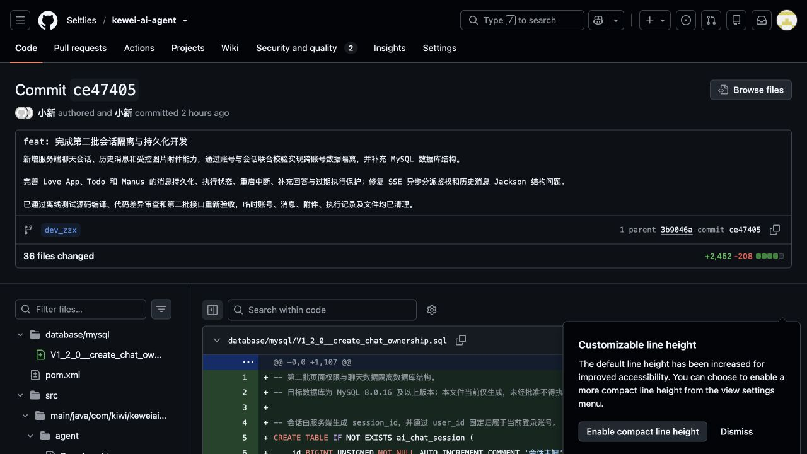

# 第二批会话隔离与持久化功能验收报告

## 一、验收结论

第二批页面权限与聊天数据隔离功能已完成数据库结构落地、后端开发、问题修复、代码审查和接口重新验收，当前结论为：**通过开发自验，可进入后续批次验收**。

| 项目 | 内容 |
| --- | --- |
| 项目 | Kewei AI Agent |
| 验收批次 | 第二批：页面权限与聊天数据隔离 |
| 验收分支 | `dev_zzx` |
| 远程提交 | `ce47405cc9568cebb41d46c13f44502f98b6e4ae` |
| 提交说明 | `feat: 完成第二批会话隔离与持久化开发` |
| 验收日期 | 2026-08-06 |
| 自验结果 | 通过 |

## 二、本批实现范围

- 新增服务端聊天会话，由服务端生成 `sessionId`，并通过 `user_id` 固定归属于当前认证账号。
- 新增当前账号会话列表、标题搜索、稳定游标分页和历史消息查询接口。
- AI 聊天接口不再接受任意账号数据归属，调用前统一校验当前账号是否拥有目标会话。
- Love App 同步回复、SSE 回复和事件流回复统一写入可恢复的聊天历史。
- Todo 和 Manus 的用户消息、AI 消息、Todo、补充问题、补充回答及结束状态写入持久化消息结构。
- 新增 Manus 执行记录，记录执行标识、状态、任务、Todo、补充问题和失败或中断原因。
- 服务重启后将遗留的 `RUNNING`、`WAITING_USER` 执行标记为 `INTERRUPTED`，不自动恢复或重复执行旧任务。
- 新增受控图片附件能力，校验真实图片内容、格式和大小，并通过账号与会话联合归属校验控制上传和读取。
- 图片写入 `ATTACHMENT_STORAGE_ROOT` 指定的服务端持久化目录，不暴露磁盘存储路径。
- 新增 MySQL 第二批数据库脚本，建立会话、附件、执行记录及消息外键约束。

## 三、数据库验收结果

已在目标 MySQL 环境执行 `V1_2_0__create_chat_ownership.sql`，结构检查结果如下：

| 检查项 | 实际结果 | 结论 |
| --- | --- | --- |
| `ai_chat_session` | 已创建，包含会话标识、账号、应用、标题和稳定分页索引 | 通过 |
| `ai_chat_attachment` | 已创建，包含附件标识、账号、会话和存储信息 | 通过 |
| `ai_agent_execution` | 已创建，包含 Manus 执行状态和结构化载荷 | 通过 |
| 消息会话外键 | `ai_chat_memory_message.conversation_id` 关联服务端会话 | 通过 |
| 会话账号外键 | 会话通过 `user_id` 关联账号，禁止产生无主会话 | 通过 |
| 附件联合归属外键 | 通过 `(session_id, user_id)` 关联会话 | 通过 |
| Manus 联合归属外键 | 通过 `(session_id, user_id)` 关联会话 | 通过 |
| 会话标识排序规则 | 使用二进制排序规则，避免大小写混淆 | 通过 |
| 图片格式与大小约束 | 仅允许 JPEG、PNG、WebP，最大 10 MB | 通过 |

## 四、接口验收结果

本轮使用两个普通临时账号执行跨账号隔离验收，并使用当前认证账号调用会话、消息、附件和 AI 接口。报告不记录密码、Cookie、Session ID、CSRF Token、附件存储路径等敏感信息。

| 验收项 | 预期结果 | 实际结果 | 结论 |
| --- | --- | --- | --- |
| 未登录访问会话列表 | 拒绝访问 | 未返回会话数据 | 通过 |
| 当前账号创建文本会话 | 服务端生成会话标识并绑定当前账号 | 创建成功，归属正确 | 通过 |
| 查询当前账号会话列表 | 只返回当前账号会话 | 未出现其他账号数据 | 通过 |
| 按标题搜索会话 | 只搜索当前账号会话标题 | 返回结果符合关键词与账号范围 | 通过 |
| 查询当前会话历史 | 返回可恢复的结构化用户与 AI 消息 | 消息角色、正文和元数据结构正确 | 通过 |
| 账号 B 读取账号 A 会话 | 拒绝且不泄露目标数据 | 未返回账号 A 会话或消息 | 通过 |
| Love App 同步回复 | 校验会话归属并持久化问答 | 回复及历史恢复成功 | 通过 |
| Love App SSE 回复 | 异步分派期间保持认证身份并持久化问答 | 流式输出及历史恢复成功 | 通过 |
| 图片附件上传 | 校验会话归属、真实图片格式和文件大小 | 合法图片上传并建立归属 | 通过 |
| 账号 B 读取账号 A 附件 | 拒绝且不暴露磁盘路径 | 未返回附件内容与路径 | 通过 |
| Manus SSE 执行 | 保存执行记录、过程消息和最终状态 | 流式事件与执行状态正确 | 通过 |
| Manus 补充回答 | 仅允许继续当前账号的有效等待执行 | 回答后继续执行并写入历史 | 通过 |
| 已结束或过期执行继续提交 | 拒绝重复继续 | 未重复执行旧任务 | 通过 |

## 五、问题修复与重新验收

首次接口验收后发现两个关键问题，已按顺序修复并重新执行完整接口验收：

1. **Manus SSE 异步分派认证上下文丢失**：流式异步线程无法稳定取得当前认证账号。现已在进入异步处理前固化受信任账号信息，并在后续服务调用中继续执行账号与会话归属校验。
2. **历史消息结构不稳定**：部分 Spring AI 消息的 Jackson 结构无法直接用于页面恢复。现已由服务端转换为稳定的历史消息响应结构，明确返回角色、正文、元数据和创建时间。

修复后，Love App、Manus、历史消息、附件和跨账号隔离接口重新验收均通过。

## 六、编译与代码审查结果

- Maven 离线测试源码编译通过。
- Git 差异格式检查通过。
- 已复核会话标识只能由服务端创建，业务接口不信任前端传入的账号或角色。
- 已复核会话、消息、附件和 Manus 执行查询均包含当前账号归属条件。
- 已复核图片下载响应不返回服务端真实存储路径。
- 已复核异步 SSE 链路不会绕过入口鉴权和会话归属校验。
- 问题修复后未发现阻止第二批交付的高优先级问题。

## 七、临时数据清理结果

接口验收使用的临时账号、会话、消息、附件、Manus 执行记录和附件文件均已清理。清理后未保留第二批验收产生的业务测试数据，正式管理员和非验收数据未被修改。

## 八、远程提交截图

截图对应 GitHub 提交：<https://github.com/Seltlies/kewei-ai-agent/commit/ce47405cc9568cebb41d46c13f44502f98b6e4ae>

## 九、验收环境说明

- 应用端口：8123，接口上下文路径：`/api`。
- MySQL、PostgreSQL、Redis 使用本地容器环境。
- 第二批数据库脚本已在 MySQL 目标库执行并完成结构检查。
- 附件使用服务端持久化目录，验收结束后同时清理数据库记录与对应文件。
- 本批为后端接口与持久化批次，不包含登录注册和账号会话页面的最终前端交互；相关页面在第三批完成。

## 十、仓库持有者建议验收项

1. 检查 `dev_zzx` 分支提交 `ce47405` 的代码和数据库脚本范围。
2. 在独立验收环境执行 `V1_2_0__create_chat_ownership.sql`，复核外键、索引和检查约束。
3. 使用两个普通账号验证会话、消息和附件跨账号隔离。
4. 分别验证 Love App 同步、SSE、事件流及 Manus 执行和补充回答链路。
5. 重启服务后确认未结束 Manus 执行被标记为中断，且不会自动重复执行。
