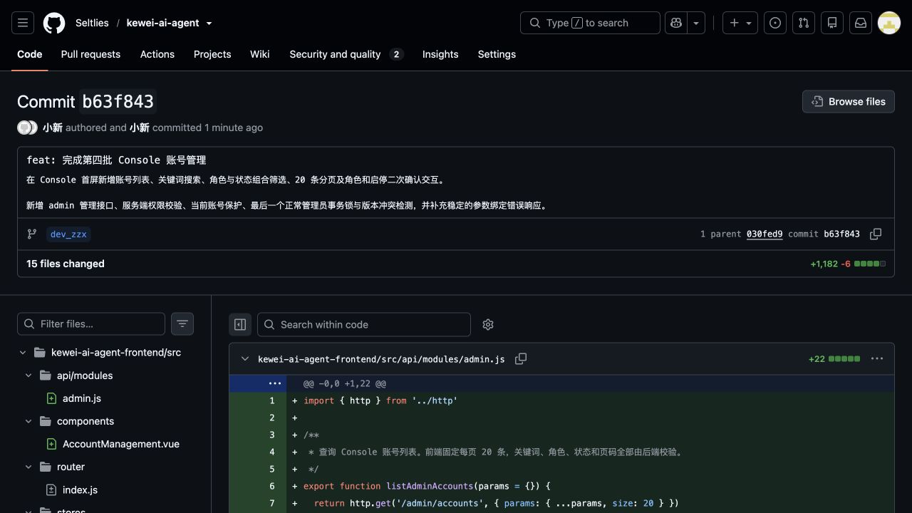

# 第四批 Console 账号管理功能验收报告

## 一、验收结论

第四批 Console 账号管理已完成后端接口、事务安全约束、前端页面、生产构建、代码检查、接口验收和浏览器端到端验收，当前结论为：**通过开发自验，账号体系与权限管理四个批次已全部完成**。

| 项目 | 内容 |
| --- | --- |
| 项目 | Kewei AI Agent |
| 验收批次 | 第四批：Console 账号管理 |
| 验收分支 | `dev_zzx` |
| 远程提交 | `b63f8437c309422e9d4be929db43f8f5f99cafd2` |
| 提交说明 | `feat: 完成第四批 Console 账号管理` |
| 验收日期 | 2026-08-07 |
| 自验结果 | 通过 |

## 二、本批实现范围

- 在 Console 首屏最前方新增账号管理区域，保留原系统状态、会话管理、API 调试面板和请求日志。
- 新增 admin 账号列表接口，支持账号关键词、角色、状态组合筛选和页码分页。
- 列表展示账号、角色、状态、注册时间、最后登录时间和当前账号标记。
- 账号关键词按登录规则去除首尾空格并转为小写，使用字面量子串搜索，避免下划线被当作通配符。
- 前端固定每页 20 条，筛选条件变化时回到第 1 页，无结果时展示“暂无符合条件的账号”。
- 新增角色调整接口和二次确认弹窗，调整结果立即影响目标账号的 Console 权限。
- 新增账号启用、停用接口和二次确认弹窗，明确停用不会中断已建立会话，但退出后不能再次登录。
- 禁止当前 admin 调整自己的角色或停用自己的账号。
- 管理事务按固定顺序锁定正常 admin，并保证系统始终保留至少一个正常状态的 admin。
- 角色和状态更新携带账号 `version`，旧页面提交时返回稳定的并发冲突响应。
- 进入 Console 前强制读取服务端最新角色；接口返回 403 时重新核对身份，不自动重放修改请求。
- 账号管理响应和页面均不提供密码、认证信息、聊天内容、账号新建或账号删除能力。

## 三、账号列表接口验收结果

接口验收阶段构造 21 个普通临时账号和 1 个临时 admin，与原有正式 admin 共同验证分页、搜索和筛选。

| 验收项 | 预期结果 | 实际结果 | 结论 |
| --- | --- | --- | --- |
| 首页分页 | 默认返回 20 条，并返回总记录数和总页数 | 返回 20 条，总数 23，共 2 页 | 通过 |
| 第二页分页 | 返回剩余账号 | 返回 3 条 | 通过 |
| 当前账号标记 | 完整结果集中只标记当前 admin | 标记唯一且账号正确 | 通过 |
| 响应字段安全 | 不返回密码、规范化账号、Session、CSRF 和聊天数据 | 未发现敏感字段 | 通过 |
| 注册和登录时间 | 展示注册时间；未登录账号显示空值供页面转换 | 字段结构正确 | 通过 |
| 关键词归一化 | 忽略首尾空格和英文字母大小写 | 指定账号唯一命中 | 通过 |
| 下划线字面量 | 下划线不能作为 SQL 通配符 | 相似非目标关键词返回 0 条 | 通过 |
| 角色筛选 | 仅返回指定角色 | admin 筛选结果全部为 admin | 通过 |
| 状态筛选 | 仅返回指定状态 | 正常状态筛选结果全部为正常账号 | 通过 |
| 组合筛选 | 搜索、角色、状态可以同时生效 | 组合条件返回唯一目标账号 | 通过 |
| 空结果 | 返回空列表和 0 个总页数 | 响应结构稳定 | 通过 |
| 非法分页 | 页码小于 1、每页数量小于 1 或大于 100 时返回 400 | 均返回统一业务响应 | 通过 |
| 非法枚举 | 非法角色或状态返回 400 | 未进入业务查询 | 通过 |
| 非法账号 ID | 无法转换为数字时返回 400 | 返回参数绑定错误 | 通过 |

## 四、权限和角色调整验收结果

| 验收项 | 预期结果 | 实际结果 | 结论 |
| --- | --- | --- | --- |
| 普通用户查询账号 | 返回 403，不泄露账号列表 | 请求被拒绝 | 通过 |
| 普通用户提升为 admin | 修改成功后原会话立即获得 Console 接口权限 | 无需重新登录即可访问 | 通过 |
| admin 降级为普通用户 | 修改成功后原会话立即失去 Console 接口权限 | 下一次请求返回 403 | 通过 |
| 当前 admin 调整自己角色 | 返回 `40904` | 返回“不能调整当前账号” | 通过 |
| 当前 admin 停用自己 | 返回 `40904` | 返回“不能调整当前账号” | 通过 |
| 不存在账号 | 返回 `40403` | 返回“账号不存在” | 通过 |

## 五、账号状态验收结果

| 验收项 | 预期结果 | 实际结果 | 结论 |
| --- | --- | --- | --- |
| 停用普通账号 | 状态修改为已停用 | 修改成功并刷新版本 | 通过 |
| 已建立会话 | 停用后当前会话继续有效，并读取最新停用状态 | `/auth/me` 正常返回停用状态 | 通过 |
| 停用账号重新登录 | 退出后拒绝再次登录 | 返回账号已停用提示 | 通过 |
| 重新启用账号 | 状态恢复正常 | 修改成功 | 通过 |
| 启用后登录 | 可以重新建立登录会话 | 登录成功 | 通过 |

停用和启用只调整账号状态，未删除账号、会话、消息或附件。

## 六、并发和最后一个正常管理员保护

| 验收项 | 预期结果 | 实际结果 | 结论 |
| --- | --- | --- | --- |
| 角色更新版本 | 使用列表返回的 `version` 更新 | 更新成功且版本加 1 | 通过 |
| 旧版本覆盖 | 使用旧 `version` 修改状态时拒绝覆盖 | 返回 `40906` | 通过 |
| 冲突后刷新 | 获取最新版本后可以继续合法操作 | 操作成功 | 通过 |
| 最后一个正常 admin 降级 | 事务内拒绝操作 | 返回 `40905` | 通过 |
| 最后一个正常 admin 停用 | 事务内拒绝操作 | 返回 `40905` | 通过 |
| 保护后的真实 admin | 角色和状态不发生变化 | 仍为唯一正常 admin | 通过 |
| 管理操作日志 | 记录操作者、目标账号、字段、前后值和结果 | 成功、自修改、冲突及最后管理员保护日志完整 | 通过 |

管理操作会先按主键顺序锁定全部正常 admin，再锁定目标账号并校验页面版本，避免并发请求导致系统不存在正常状态的 admin。

## 七、Console 页面验收结果

页面验收额外创建 1 个专用临时 admin，使用真实浏览器完成登录、筛选、分页和弹窗交互，所有修改弹窗均在确认前取消，未产生额外业务写入。

| 验收项 | 预期结果 | 实际结果 | 结论 |
| --- | --- | --- | --- |
| Console 首屏 | 账号管理展示在原有功能之前 | 位置正确 | 通过 |
| 原有 Console 功能 | 系统状态、会话管理、API 调试和请求日志继续显示 | 全部保留 | 通过 |
| 页面字段 | 展示账号、角色、状态、注册时间、最后登录时间和操作 | 展示完整 | 通过 |
| 每页数量 | 默认展示 20 条 | 第 1 页显示 20 条 | 通过 |
| 页面翻页 | 下一页展示剩余账号和正确区间 | 显示第 2 页及正确范围 | 通过 |
| 当前账号 | 展示“当前账号”且不提供修改按钮 | 展示“不可调整自己的账号” | 通过 |
| 搜索 | 停止输入后请求服务端并回到第 1 页 | 指定账号唯一命中 | 通过 |
| 搜索无结果 | 展示空结果提示和 0 / 0 | 页面状态正确 | 通过 |
| 角色和状态组合筛选 | 同时按 admin 和正常状态筛选 | 总数和行数据正确 | 通过 |
| 角色二次确认 | 明确目标账号和调整后的角色 | 文案正确，取消后无写入 | 通过 |
| 停用二次确认 | 明确目标账号、目标状态和现有会话行为 | 警告文案正确，取消后无写入 | 通过 |
| 页面视觉 | 延续现有暖色卡片、表格和按钮风格 | 布局清晰，无明显遮挡 | 通过 |

## 八、构建、代码检查和运行日志

- 后端执行 `./mvnw -DskipTests package`，结果为 `BUILD SUCCESS`。
- 前端执行 `npm run build`，Vite 生产构建通过，共转换 192 个模块。
- `git diff --check` 通过，未发现空白字符或补丁格式问题。
- 后端健康检查返回 HTTP 200，前端首页返回 HTTP 200。
- 已复核账号管理接口只允许 admin 调用，操作者身份只来自服务端认证主体。
- 已复核查询响应只选择页面需要的字段，不读取或返回密码摘要。
- 已复核角色和状态修改在 MySQL 事务中完成，并包含正常 admin 锁和账号版本条件。
- 已复核前端遇到 403 时不自动重放原修改请求。
- 验收日志中的 WARN 均对应预期拒绝场景，包括凭据不匹配、自修改、停用账号登录、旧版本冲突和最后管理员保护；未发现阻止交付的异常。
- 本批采用生产构建、代码检查、接口验收和浏览器端到端验收，未新增或执行单元测试。

## 九、临时数据和认证信息清理结果

接口和页面验收共使用 21 个普通临时账号及 2 个临时 admin。验收结束后已注销接口会话和浏览器会话，并执行已批准的清理 DML。

| 检查项 | 清理结果 |
| --- | ---: |
| 已删除临时账号 | 23 |
| 临时账号剩余数量 | 0 |
| 数据库账号总数 | 1 |
| 正常状态 admin 数量 | 1 |

临时密码、Cookie、CSRF Token 和接口响应文件已删除。清理未修改正式 admin 的角色和状态，报告未记录密码、Cookie、Session ID、CSRF Token 或其他认证信息。

## 十、远程提交截图

截图对应 GitHub 提交：<https://github.com/Seltlies/kewei-ai-agent/commit/b63f8437c309422e9d4be929db43f8f5f99cafd2>

## 十一、验收环境说明

- 前端地址：`http://localhost:5173`。
- 后端端口：8123，接口上下文路径：`/api`。
- MySQL、PostgreSQL、Redis 使用本地容器环境。
- Nacos 中的本地数据库及 Redis 凭据与当前容器配置不一致，本轮通过运行环境变量使用容器当前配置启动；未将凭据写入代码、报告或日志。
- 本地运行环境存在 Netty macOS DNS 原生库缺失警告，应用已使用系统 DNS 正常启动，该警告未影响本批账号管理验收。

## 十二、仓库持有者建议验收项

1. 检查 `dev_zzx` 分支提交 `b63f843` 的前后端改造范围。
2. 使用 admin 进入 Console，确认账号管理位于首屏且原有 Console 功能仍可用。
3. 创建超过 20 个账号，验证关键词、角色、状态组合筛选和页码分页。
4. 使用两个账号验证角色提升后权限立即获得、角色降级后权限立即失效。
5. 停用一个已登录账号，确认现有会话继续有效，退出后不能重新登录；重新启用后可以登录。
6. 使用两个 admin 验证角色和状态修改，并确认无法降级或停用最后一个正常 admin。
7. 并发修改同一账号的角色和状态，确认旧版本请求返回冲突且不会覆盖先完成的操作。
8. 检查账号管理页面不存在账号新建、删除、密码查看和聊天内容查看入口。
